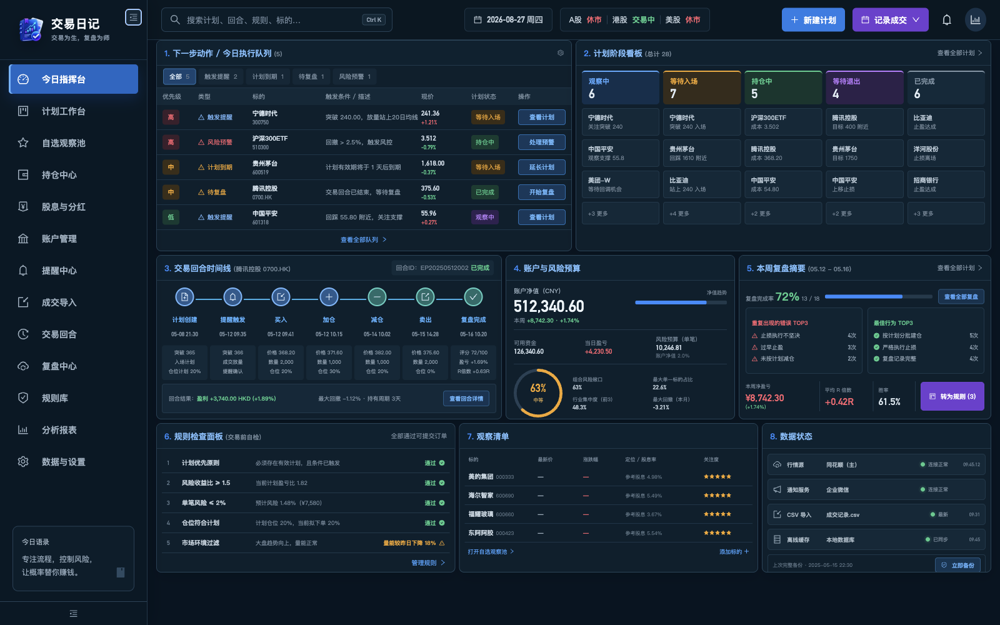
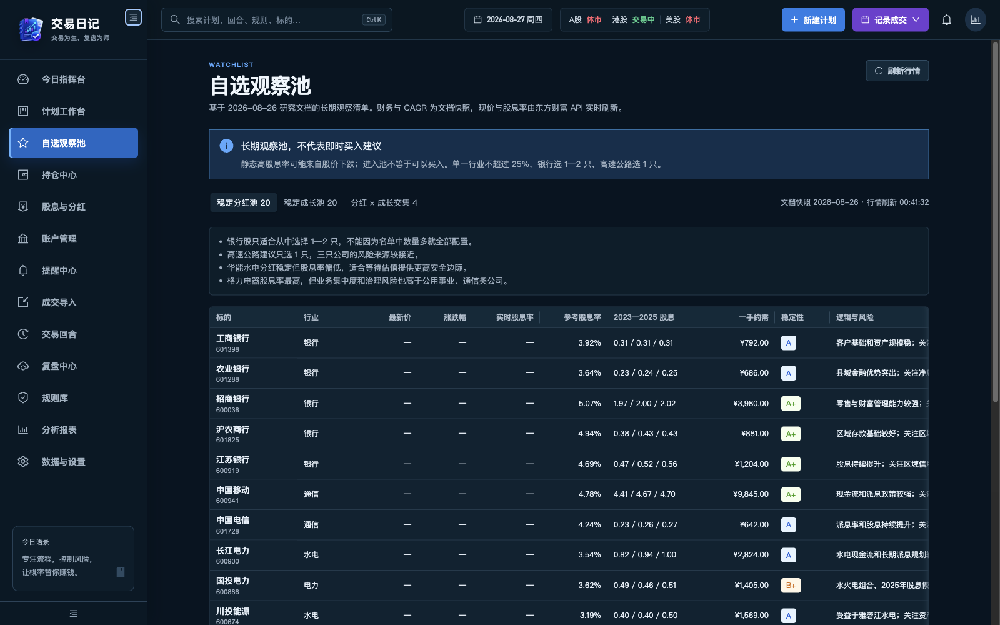
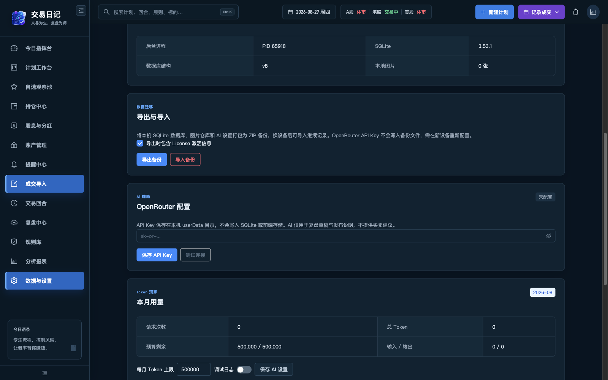

<p align="center">
  
</p>

<h1 align="center">交易日记</h1>

<p align="center">
  把交易计划、提醒、成交、持仓与复盘串成闭环的本地优先桌面工作台。
</p>

<p align="center">
  <strong>计划先于行动 · 过程与结果分开 · 数据属于用户</strong>
</p>

<p align="center">
  
  
  
  
  
</p>

<p align="center">
  <a href="https://github.com/minimissile/trading-diary/releases">下载最新版本</a>
  · <a href="docs/PRODUCT_FUNCTIONAL_DESIGN.md">产品设计</a>
  · <a href="docs/ARCHITECTURE.md">技术架构</a>
  · <a href="#本地开发">参与开发</a>
</p>



> [!IMPORTANT]
> 交易日记帮助你落实自己的交易系统，不提供个股推荐，也不会自动下单。

## 为什么做交易日记

多数交易工具擅长展示行情或盈亏，却很少回答三个真正影响长期表现的问题：入场前是否有计划，执行时是否遵守纪律，结束后是否沉淀了可复用的经验。

交易日记围绕“过程可追踪、风险可度量、复盘可改进”设计，把分散在表格、笔记和提醒软件里的工作集中到一个桌面客户端中。

| 你需要解决的问题         | 交易日记提供的工作台                           |
| ------------------------ | ---------------------------------------------- |
| 今天应该先处理什么？     | 今日执行队列、计划阶段看板、风险预算与规则自检 |
| 如何减少临盘冲动？       | 盘前计划、入场/失效条件、价格提醒与状态流转    |
| 一笔交易为什么赚或亏？   | 成交记录、交易回合时间线、截图证据与单笔复盘   |
| 怎样持续改进系统？       | 错误标签、规则检查、周期统计与复盘摘要         |
| 数据能否掌握在自己手中？ | 本地 SQLite、图片仓库、ZIP 备份与恢复          |

## 产品闭环


## 核心能力

- **今日指挥台**：把触发提醒、到期计划、待复盘事项和风险预警汇总成下一步动作。
- **计划与提醒**：记录方向、入场区间、止损、目标位、失效条件与复盘时间，并跟踪计划状态。
- **自选观察池**：管理长期观察标的与研究快照，结合行情、股息率、稳定性和风险说明辅助研究。
- **账户与持仓**：统一管理交易账户、持仓、现金分红与收益口径。
- **成交与交易回合**：导入或记录买卖成交，将同一标的的一组交易组织成完整回合。
- **复盘与分析**：保存执行证据、错误标签、规则命中和结果指标，形成周期改进线索。
- **本地数据与备份**：核心记录保存在本机 SQLite；数据库、图片和 AI 设置可导出为 ZIP 并恢复。
- **可选 AI 辅助**：通过 OpenRouter 生成复盘草稿和发布说明；API Key 仅保存在本机且不会写入备份。

## 界面预览

<table>
  <tr>
    <td width="50%">
      
    </td>
    <td width="50%">
      
    </td>
  </tr>
  <tr>
    <td align="center"><strong>自选观察池</strong><br />研究快照、股息数据与风险提示</td>
    <td align="center"><strong>本地优先</strong><br />SQLite、备份迁移与可选 AI 配置</td>
  </tr>
</table>

## 本地优先，也为扩展而设计

渲染进程不直接接触 Node.js 或数据库。所有能力通过类型化 preload API 进入 Electron 主进程，再由独立 Utility Process 处理 SQLite、图片、备份与第三方连接器任务。

```text
React Renderer
      ↓ 类型化 preload API
Electron Main（窗口、协议、IPC、更新）
      ↓ 请求/响应协议
Utility Process（业务服务、连接器、后台任务）
      ↓
SQLite + 内容哈希图片仓库
```

安全边界包括 Renderer Sandbox、Context Isolation、CSP、IPC 来源校验，以及受控的 `app://` / `app-asset://` 本地协议。更多细节见[架构说明](docs/ARCHITECTURE.md)。

## 本地开发

### 环境要求

- Node.js `>= 22.22.0`，推荐 Node.js 24 LTS
- npm 11
- macOS 或 Windows

### 启动项目

```bash
git clone https://github.com/minimissile/trading-diary.git
cd trading-diary
npm install
npm run dev
```

### 常用命令

| 命令               | 用途                           |
| ------------------ | ------------------------------ |
| `npm run dev`      | 启动 Electron 开发环境         |
| `npm run check`    | 运行格式、Lint、类型与测试检查 |
| `npm run build`    | 生成生产构建                   |
| `npm run package`  | 生成当前平台的本地目录包       |
| `npm run dist:mac` | 构建 macOS DMG / ZIP           |
| `npm run dist:win` | 构建 Windows NSIS 安装包       |
| `npm run release`  | 递增版本并创建发布流程         |

### 项目结构

```text
src/
├── main/       # Electron 生命周期、窗口、IPC、协议与更新
├── preload/    # 暴露给页面的最小类型化 API
├── renderer/   # React 页面、组件、主题与路由
├── service/    # Utility Process、SQLite、备份与业务服务
└── shared/     # 跨进程类型、Schema 与 IPC 契约
tests/          # 数据库、备份、费用、更新与图片仓库测试
docs/           # 产品、架构、主题和发布文档
```

## 技术栈

| 层级       | 方案                                                     |
| ---------- | -------------------------------------------------------- |
| 桌面运行时 | Electron 43、electron-vite 5、electron-builder           |
| 前端       | React 19、TypeScript 5.9、Ant Design 6、React Router 8   |
| 数据与校验 | Electron `node:sqlite`、Zod 4、Sharp                     |
| 质量保障   | ESLint、Prettier、Vitest、TypeScript project references  |
| 分发更新   | GitHub Releases；Windows 应用内更新，macOS 跳转 DMG 下载 |

## 文档

- [产品功能设计](docs/PRODUCT_FUNCTIONAL_DESIGN.md)：目标用户、核心原则与完整工作流
- [架构说明](docs/ARCHITECTURE.md)：进程边界、存储、协议与安全设计
- [UI 组件约定](docs/UI_COMPONENTS.md)：组件选型与开发规范
- [主题系统](docs/UI_THEME.md)：Token、交易方向色与扩展规则
- [LLM 开发说明](docs/LLM_DEVELOPMENT.md)：OpenRouter 接入与调试
- [客户端更新流程](docs/CLIENT_UPDATE_FLOW.md)：Windows / macOS 更新体验
- [自动发布配置](docs/AUTO_UPDATE.md)：构建、签名与 GitHub Releases

## 参与贡献

欢迎提交 Issue、功能建议和 Pull Request。开始编码前，建议先阅读产品功能设计和架构说明；提交前请运行：

```bash
npm run check
```

如果新增跨进程能力，请同步维护 preload 类型、IPC channel、Zod schema 与测试，避免绕过现有安全边界。

## 数据与风险声明

- 核心记录默认保存在用户设备中，请定期导出备份并验证可恢复性。
- 行情与研究数据可能延迟或不完整，仅供记录和研究，不构成投资建议。
- 使用本项目进行交易决策的风险由使用者自行承担。

## License

MIT License
