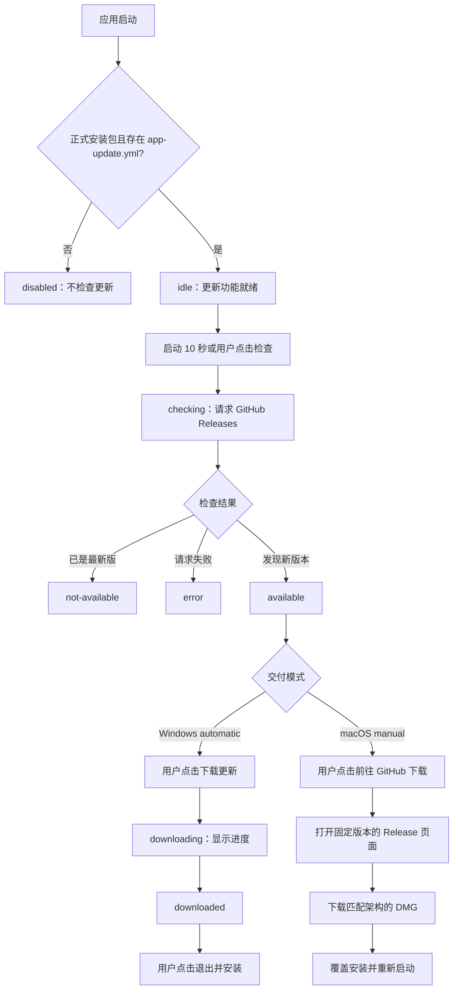

# 客户端更新流程

本文说明客户端从启动检查到完成升级的运行时流程，供开发、发布和测试人员共同使用。
构建参数、GitHub Release 资产和发布命令见 [客户端更新配置](AUTO_UPDATE.md)。

## 当前更新策略

| 环境或平台 | 更新方式 | 用户操作 | 安装方式 |
| --- | --- | --- | --- |
| 开发环境 | 禁用更新检查 | 无 | 无 |
| Windows 正式安装包 | 应用内更新 | 确认下载，下载后确认退出安装 | `electron-updater` 调用 NSIS 安装器 |
| macOS 正式安装包 | 自动检查、手动更新 | 前往 GitHub，下载匹配 CPU 的 DMG | 手动将应用拖入「应用程序」并覆盖旧版本 |

这里的 Windows“应用内更新”表示客户端具备下载和安装能力，但当前仍由用户点击按钮触发，
不是后台静默下载或无人值守安装。macOS 不在应用内下载或安装，因此不依赖付费的 Apple
Developer ID，也不会进入 Squirrel.Mac 的代码签名校验流程。

## 总体流程



## 启动与初始化

1. Electron 主进程创建 `UpdateManager`，并根据当前平台确定交付模式：macOS 为
   `manual`，Windows 为 `automatic`。
2. 主进程注册类型化 IPC。渲染进程通过 preload 暴露的最小接口读取状态和发起操作。
3. `UpdateManager.start()` 检查当前是否为正式打包应用，以及资源目录中是否存在
   `app-update.yml`。
4. 条件不满足时进入 `disabled`；条件满足时注册 `electron-updater` 事件并进入 `idle`。
5. 主进程将更新状态推送给渲染进程，设置页的更新面板据此显示按钮、进度和提示。
6. 初始化完成 10 秒后自动检查一次。用户也可以随时点击「检查更新」，重复请求会合并为同一个
   检查任务。

`npm run dev` 不访问 GitHub。`npm run package` 生成的本地目录包也不用于更新验收，因为目录包
不包含正式发布流程写入的 `app-update.yml`。必须使用 `npm run dist:mac`、`npm run dist:win`
或 GitHub Actions 生成的正式安装包测试更新。

## Windows 更新流程

1. 客户端从安装包内的 `app-update.yml` 读取 GitHub Provider 配置。
2. `electron-updater` 请求 Release 中的 `latest.yml`，并比较当前应用版本与最新版本。
3. 发现新版本后进入 `available`，界面显示「下载更新」。
4. 用户确认下载后进入 `downloading`，界面显示下载进度。
5. 下载和完整性验证完成后进入 `downloaded`，界面显示「退出并安装」。
6. 用户点击后，客户端调用 `quitAndInstall(false, true)`，退出应用并启动 NSIS 安装器。
7. 安装完成后重新打开客户端，确认版本号、SQLite 数据库和图片仓库均正常。

Windows 应用内更新依赖以下 Release 资产同时存在：

- `latest.yml`
- `trading-diary-<version>-x64-win.exe`
- `trading-diary-<version>-x64-win.exe.blockmap`

## macOS 更新流程

1. 客户端使用 `latest-mac.yml` 检查 GitHub Release 中是否存在更高版本。
2. 发现新版本后进入 `available`，界面显示「前往 GitHub 下载」。
3. 用户点击后，主进程根据已检测到的版本号拼出固定地址：
   `https://github.com/minimissile/trading-diary/releases/tag/v<version>`。
4. 系统默认浏览器打开对应 Release；用户根据 Mac 的 CPU 下载 DMG：
   - Apple Silicon（M 系列）：`arm64-mac.dmg`
   - Intel：`x64-mac.dmg`
5. 打开 DMG，将应用拖入「应用程序」并确认覆盖旧版本。
6. 重新启动应用，确认版本号和本地数据均正常。

当前 macOS 安装包使用 ad-hoc 签名。首次打开新版本时，Gatekeeper 可能提示应用无法验证，用户
可右键选择「打开」，或前往「系统设置 → 隐私与安全性」确认。该提示与客户端版本检查是否成功
无关。

Release 中仍会生成 macOS ZIP 和 `latest-mac.yml`，用于生成并读取兼容的版本元数据；当前客户端
只读取元数据，不下载或安装 ZIP。

## 状态机与界面行为

| 状态 | 含义 | 界面行为或下一步 |
| --- | --- | --- |
| `disabled` | 开发环境或安装包缺少更新源 | 显示禁用原因，不发起检查 |
| `idle` | 更新功能已初始化 | 可点击「检查更新」 |
| `checking` | 正在请求 GitHub Releases | 显示加载状态，避免重复点击 |
| `not-available` | 当前版本已是最新版 | 显示当前已是最新版本 |
| `available` + `automatic` | Windows 检测到新版本 | 显示「下载更新」 |
| `available` + `manual` | macOS 检测到新版本 | 显示「前往 GitHub 下载」 |
| `downloading` | Windows 正在下载 | 显示 0–100% 下载进度 |
| `downloaded` | Windows 安装包已就绪 | 显示「退出并安装」 |
| `error` | 检查、下载或安装准备失败 | 显示错误信息，允许重新检查 |

共享状态还包含当前版本、可用版本、下载百分比和面向用户的中文提示。渲染进程只根据状态渲染，
不自行判断版本，也不直接控制更新器。

## 进程与安全边界

```text
React 更新面板
  → window.desktop.updater
  → preload 类型化桥接
  → 受信任来源校验的 IPC
  → 主进程 UpdateManager
  → electron-updater / shell.openExternal
  → GitHub Releases
```

- 渲染进程不能直接访问 Node.js、`electron-updater` 或 Electron `shell`。
- 每个更新 IPC 请求都会校验发送方是否来自受信任的应用页面。
- macOS 的下载页由主进程根据已检测到的版本和固定仓库地址生成，渲染进程不能传入任意 URL。
- `autoDownload` 和 `autoInstallOnAppQuit` 均关闭，避免未经用户确认的下载或安装。
- 同一时间只执行一个版本检查，防止连续点击产生并发请求。

## 版本与 Release 约定

- `package.json` 中的版本使用标准语义化版本，例如 `1.3.0`。
- Git tag 和 GitHub Release 名称使用对应的 `v1.3.0`。
- 新版本号必须高于已安装版本；不要覆盖同版本 Release 的资产。
- Release 不能保持 Draft 状态，所需平台资产必须上传完整后再进行验收。
- macOS 手动下载地址指向检测到的固定版本，而不是不稳定的 Releases 首页。
- 发布错误版本时，发布一个更高版本号的修复包，避免客户端或 GitHub 缓存继续命中旧资产。

## 旧版本迁移

早期 macOS 测试版曾调用 Squirrel.Mac 下载和安装更新。未使用 Developer ID 签名的安装包会在
安装阶段出现 `Code signature did not pass validation`。旧客户端本身尚未包含当前手动更新策略，
因此需要进行一次人工迁移：

1. 在 GitHub Release 中下载首个包含当前手动更新策略的 DMG。
2. 手动覆盖旧客户端。
3. 从此版本开始，后续新版本会自动检查并引导到对应 Release，不再调用 Squirrel.Mac 安装。

## 常见故障与处理

| 现象 | 常见原因 | 处理方式 |
| --- | --- | --- |
| 显示“开发环境不启用自动更新” | 使用 `npm run dev` | 改用正式安装包验证 |
| 显示“当前安装包未配置 GitHub 更新源” | 使用目录包，或打包未写入 `app-update.yml` | 使用 `dist:*` 构建，检查 electron-builder publish 配置 |
| 检查更新失败 | 网络无法访问 GitHub、Release 不可见或元数据缺失 | 检查网络、Release 状态及 `latest*.yml` |
| 发布了新版本但检测不到 | 版本号未递增、tag 不匹配、Release 为 Draft | 对齐版本与 `v*` tag，发布更高版本并公开 Release |
| Windows 下载失败 | EXE、blockmap 或 `latest.yml` 不完整 | 补齐同一 Release 的 Windows 资产后重新发布新版本 |
| macOS 下载按钮打开 404 | 检测元数据中的版本没有对应 tag | 确认 `latest-mac.yml` 与 `v<version>` Release 一致 |
| macOS 应用无法启动 | Gatekeeper 不信任 ad-hoc 签名 | 右键打开，或在「隐私与安全性」中确认 |
| macOS 安装后无法运行 | 下载了错误的 CPU 架构 | Apple Silicon 使用 arm64，Intel 使用 x64 |
| macOS 仍出现代码签名校验错误 | 仍在运行旧的自动安装测试版 | 手动安装一次包含当前策略的新 DMG |
| 更新后数据丢失 | 数据写入了安装目录，或用户数据目录被错误清理 | 数据库和图片必须保存在 `app.getPath('userData')` 管理的数据目录中 |

## 发布前验收清单

- [ ] 使用正式安装的较低版本作为升级起点，不使用开发环境或目录包。
- [ ] `package.json` 版本、Git tag、Release 版本和元数据版本一致。
- [ ] GitHub Release 已公开，Windows 和 macOS 资产完整。
- [ ] 应用启动 10 秒后会检查更新，手动「检查更新」也可正常使用。
- [ ] Windows 可完成检查、下载、退出安装和新版本启动。
- [ ] macOS 可打开准确的版本页面，并可用正确架构 DMG 覆盖安装。
- [ ] 无更新、断网、Release 缺失等失败场景能显示可理解的中文提示。
- [ ] 升级前后的 SQLite 数据库、图片原图、缩略图和用户配置保持不变。

## 相关实现

- [更新状态机与平台流程](../src/main/updater/update-manager.ts)
- [平台交付策略与 Release 地址](../src/main/updater/update-policy.ts)
- [主进程 IPC 与来源校验](../src/main/ipc.ts)
- [preload 类型化桥接](../src/preload/index.ts)
- [更新面板](../src/renderer/components/UpdaterPanel.tsx)
- [共享更新状态类型](../src/shared/api.types.ts)
- [构建、发布与 Release 资产说明](AUTO_UPDATE.md)
