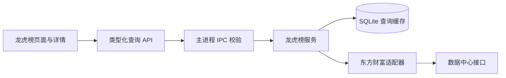

# 龙虎榜：数据源验证与模块方案

更新：2026-09-06。阶段：已完成首版及筛选扩展，支持逐日浏览、自然周 / 月 / 季度与上榜次数查询。

## 结论

已实现历史日期、日期区间、个股和数值条件查询，并查询对应的买卖席位明细。按用户确认，首版直接使用东方财富数据中心接口，复用项目现有 HTTP 客户端，以 SQLite 缓存查询数据，不增加 Python 运行时。

可行性阶段使用 Node 原生 fetch 从当前机器发起真实请求，20 项检查通过。开发阶段又通过真实服务和临时数据库验证主表、组合筛选、沪深京席位及历史数据；具体交付与验证见第 7 节。

- 探测脚本：[probe-longhubang.mjs](../scripts/probe-longhubang.mjs)
- 请求参数、URL、返回字段、样本及耗时：[实测结果 JSON](LONGHUBANG_PROBE_2026-09-05.json)
- 复跑：`node scripts/probe-longhubang.mjs /tmp/longhubang-probe.json`，需要网络访问；不传输出路径时只输出控制台。

## 1. 实测结果

测试时间为北京时间 2026-09-05 23:00 左右。以下数量为接口上榜记录数，不等同于股票数；原始查询未排除非股票品种。

| 查询 | 实测结果 | 已核对内容 |
| --- | --- | --- |
| 最新日期 | 2026-09-04，66 条、55 个证券代码 | 当日全量返回，净买额与买入减卖出一致，候选事件键无重复 |
| 历史日 2025-09-05 | 87 条 | 返回日期一致 |
| 历史日 2024-01-05 | 65 条 | 返回日期一致 |
| 历史日 2020-01-02 | 48 条 | 返回日期一致 |
| 历史日 2007-04-16 | 23 条 | 返回日期一致 |
| 2024-01-02 至 2024-01-05 | 274 条 | 日期范围正确，前两页各 10 条与全量排序结果逐条一致 |
| 2026-09-04：净买额 ≥ 5000 万、涨幅 ≥ 5%、换手率 ≥ 10% | 13 条 | 与本地全量筛选集合相同，按净买额降序正确 |
| 2026-09-04：深市且为股票类型 | 27 条 | 服务端筛选与完整当日数据一致 |
| 2026-09-04：指定上榜原因代码 | 10 条 | 服务端筛选与完整当日数据一致 |
| 个股 000892 历史 | 共 141 条，取前 20 条 | 股票代码一致 |
| 000892，2026-09-04 席位 | 买榜 20 条、卖榜 20 条 | 日期、代码及金额字段正确；一个日期包含多个上榜原因 |
| 600077，2007-04-16 席位 | 买榜 5 条、卖榜 5 条 | 历史席位也可访问 |
| 2026-09-04 机构每日统计 | 30 条 | 返回机构买卖金额和参与数量字段 |
| 非交易日 2024-01-06 | HTTP 200，`success=false`，`code=9201`，`返回数据为空` | 需识别已知空数据状态，不能把全部 `success=false` 都当空列表 |
| 全局按日期升序取首条 | 2004-06-25 | 仅证明当前可检索到这一日期，不代表历史连续、各交易所完整覆盖 |

最终一轮请求耗时约 57–354ms，仅代表本机当时的少量请求，不构成性能或持续可用性承诺。首轮空数据测试因未识别中文返回文案而失败，按真实 `9201 / 返回数据为空` 响应修正后复跑通过。

### 数据源选择

| 来源 | 能力和接入条件 | 本次验证程度 | 定位 |
| --- | --- | --- | --- |
| 东方财富数据中心 | 本次请求无需 Token；日期、条件筛选、分页、席位、机构统计 | 真实请求通过 | 首选适配器；属于网站使用的接口，需处理变更和不可用 |
| 同花顺数据中心 | 无 Cookie / Token 的普通网页 GET 可返回日期榜单、个股历史与席位 HTML | 最新日、2024 年榜单及 2020 年席位已查通；2007-04-16 返回空，东财同日有数据 | 可作候选或核对源；需解析 HTML，历史覆盖需另核对，详见下节 |
| AKShare 的东财龙虎榜接口 | 提供日期范围和席位查询的 Python 封装 | 阅读官方文档和当前实现；没有安装或运行 AKShare | 参数参考；其东财接口与直连共用上游，不是独立备援 |
| Tushare Pro | `top_list` 文档写明历史始于 2005 年，需至少 2000 积分；`top_inst` 需至少 5000 积分 | 只核对官方文档，未取得或使用 Token，未实测返回数据 | 可选替代适配器，具备权限后再联调 |

资料：[东方财富龙虎榜页面](https://data.eastmoney.com/stock/tradedetail.html)、[AKShare 龙虎榜文档](https://akshare.akfamily.xyz/data/stock/stock.html)、[AKShare 当前源码](https://github.com/akfamily/akshare/blob/main/akshare/stock_feature/stock_lhb_em.py)、[Tushare 每日明细](https://tushare.pro/document/2?doc_id=106)、[Tushare 机构明细](https://tushare.pro/document/2?doc_id=107)。

不在首版引入第二套数据运行环境。若后续需要稳定商业分发，再确认来源服务条款及适配器授权条件；本次只验证技术可访问性。

### 2026-09-05 补充：同花顺实测

同花顺有可查询的数据源，不能归为“没有数据源”。完成对比后，用户确认优先使用东方财富，随后开始开发。两者提供同类交易所披露信息，但覆盖范围、呈现粒度及金额精度不能默认完全一致。

[请求与数据摘要](LONGHUBANG_THS_PROBE_2026-09-05.json)记录本机真实 GET 结果：

| 查询 | 返回结果 |
| --- | --- |
| 当日榜单 2026-09-04 | HTTP 200，55 个证券代码；返回报告日期一致 |
| 历史榜单 2024-01-05 | HTTP 200，51 个证券代码；返回报告日期一致 |
| 历史榜单 2007-04-16 | HTTP 200，页面显示没有符合条件的数据；东财同日返回 23 条 |
| 非交易日 2024-01-06 | HTTP 200，页面显示没有符合条件的数据 |
| 个股历史 300263 | HTTP 200，可见包含日期与原因编号的历史记录 |
| 300263 / 2020-04-08 / 原因 3 | HTTP 200，买卖前五席位、金额和占比均可见；买入榜合计显示 4583.79 万元 |

使用的是公开页面自身 JavaScript 中的接口：

- 按日榜单：`https://data.10jqka.com.cn/ifmarket/lhbggxq/report/YYYY-MM-DD/`。
- 个股历史：`https://data.10jqka.com.cn/market/lhbgg/code/股票代码/`。
- 原因对应席位：`https://data.10jqka.com.cn/ifmarket/getnewlh/code/股票代码/date/YYYY-MM-DD/rid/原因编号/`。

初次不带常规浏览器请求头访问主页得到 HTTP 403；后续带普通 User-Agent 和 Referer 的主页、历史和明细请求均成功。没有登录、没有读取 Cookie，也没有执行验证码或挑战破解。这里只证明上述请求当时可访问，不推断长期稳定性。

当前权衡：

- 同花顺网页提供 HTML / GBK 文本，需处理编码、表格结构、空页面和格式变化。金额通常以万元保留两位小数，不能宣称精确到分。
- 东财返回 JSON 和以元表示的金额，已实测服务端数值组合筛选及分页；与本项目已有客户端直接兼容。
- 两源都存在历史数据，不同日期和聚合粒度的覆盖不能默认一致；同花顺 2007 年抽样为空，并不代表它完全没有更早历史。
- 本次未验证同花顺服务端的任意金额条件组合；可行实现是按日获取完整页面，再在后台解析、筛选、排序和分页。
- [同花顺量化平台](https://quant.10jqka.com.cn/view/dataplatform/detail/538)也正式列出龙虎榜明细、机构统计和按原因去重的表结构；本次只查文档，未配置或实测其 SDK / 数据权限。

建议保留原页面设计，以东方财富为主源；同花顺先用于人工核对或后续单独适配。两源若同时接入，应显示来源，不直接混合加总，也不把同花顺的“游资”等标签当作权威身份。

官方入口：[同花顺龙虎榜](https://data.10jqka.com.cn/market/longhu/)、[300263 历史榜单](https://data.10jqka.com.cn/market/lhbgg/code/300263/)、[同花顺量化龙虎榜字段](https://quant.10jqka.com.cn/view/dataplatform/detail/538)。

## 2. 首版用户流程

侧栏在自选与策略入口附近新增“龙虎榜”，独立路由 `/dragon-tiger`，不依赖用户选择账户。

1. 打开后展示“最新已披露日期”，以接口实际最新日期为准。
2. 选择单日或日期区间，也可使用近 7 / 30 个自然日快捷范围，均以最新披露日为终点。
3. 输入股票、金额等条件，点击“查询”；支持重置和“净买入 ≥ 5000 万”快捷条件。自定义条件保存留待后续。
4. 在列表查看上榜事件，点击一条打开右侧详情，查看该原因对应的买卖席位。
5. 在详情中切换同股同日的其他原因；关闭详情保留筛选和分页位置。点击历史入口将主列表切换为该股自 2004 年起的上榜记录。

### 页面结构

| 区域 | 内容与交互 |
| --- | --- |
| 标题栏 | 龙虎榜、所查日期、最新披露日期、刷新按钮 |
| 概览 | 筛选结果记录数、去重证券数、所覆盖交易日数；统计完成前显示加载状态 |
| 常用筛选 | 单日 / 区间、日期、股票代码或名称、市场、净买入范围 |
| 更多条件 | 涨跌幅、换手率、流通市值、上榜原因、单日 / 多日榜；机构买卖金额、机构数和参与条件已接入 |
| 结果表 | 日期、股票、涨跌幅、龙虎榜买入额 / 卖出额 / 净买额、换手率、原因 |
| 右侧详情 | 股票和日期、原因切换、榜单统计周期、买入榜、卖出榜、个股历史、来源与更新时间 |

采用现有石墨底色、青碧交互色、暖金次重点色；财务列右对齐，红色表示正值、绿色表示负值，输入和表格保持直角。日期输入、折叠筛选、表格、抽屉直接复用 Ant Design 与公共主题。

### 条件的实现方式

| 条件 | 首版处理 | 实现边界 |
| --- | --- | --- |
| 单日、日期区间、股票代码、股票类型 | 上游过滤 | 服务层校验输入，由适配器白名单构造；排除非股票品种 |
| 市场、净买额、涨跌幅、换手率、流通市值 | 后台对完整查询范围筛选 | 数值统一单位，支持上下限；统计、排序、分页在筛选后执行 |
| 买卖额、净买占比、成交额及成交占比 | 后台对完整查询范围筛选 | 已提供上下限与排序；可选择补充显示字段 |
| 名称关键词、原因分类 | 后台对完整查询范围筛选 | 不只筛选当前页；名称匹配按源返回名称，不承诺历史曾用名检索 |
| 机构参与、机构净买额 | 已接入，按同标的、日期、原因关联 | 机构字段只按精确原因关联；重复关联键时报错，不跨原因复用 |
| 单日 / 多日榜 | 按上榜原因映射榜单周期 | 原文保留；识别不了的原因归“其他”，不默认成单日 |

后续自定义预设只保存筛选值，不自动交易；首版提供固定快捷条件。

默认查询沪深京 A 股，可切换到可转债或两者。样本中 66 条包含 65 条 `058001001` 与 1 条 `060`，不能把上游默认全集直接称为 A 股榜。

龙虎榜使用独立的 `LhbExchange = SH | SZ | BJ | UNKNOWN` 展示和查询，不改动现有 `InstrumentVenue`，也不将 BJ 映射为沪市；已实测北交所 920065 的列表及席位。K 线、计划等联动留待后续按市场支持情况接入。

## 3. 数据口径与容易出错的地方

### 同股多榜与席位重复

- 一行代表一条披露事件。优先使用源 `TRADE_ID` 做事件标识，同时保留交易所、股票、日期、原因代码和原文。
- 最新日 55 个证券代码对应 66 条记录；000892 买榜、卖榜各 20 行包含多个原因，不能全局取前五条就展示。
- 详情必须先按事件 / 原因分组，再分别排列买榜、卖榜。主表和席位表的 `TRADE_ID` 返回类型不同，统一转字符串后核对关联。
- 同一个营业部可能同时出现于买榜和卖榜，“机构专用”也不能只按显示名称合并。存储保留榜单方向和组内名次；不把两榜简单相加计算净额。
- 单日榜与连续多日榜可能覆盖重叠交易。首版概览只展示计数，不把全部记录金额加总为“全市场资金净流入”。即便只取单日榜，也需处理不同原因重复披露的问题。
- 龙虎榜净买额是披露席位范围的统计，不等于该股票全部成交的资金净流入。

### 日期、名称与单位

- 日期使用中国市场 `YYYY-MM-DD`，避免转换为 UTC 后偏移。明确区分上榜日期、查询日期、抓取时间。
- 默认“最新已披露”不固定到今天或上一工作日；非交易日不生成虚假榜单。快捷交易日范围需使用交易日历或已覆盖日期，不能直接减自然日冒充交易日。
- 今天暂时为空只表示“暂未查到披露”，不自动认定该日最终无榜；断网显示重试或带时间的缓存结果。
- 历史记录里的名称及板块标签不应当作当时快照。例如最早样本返回“ST鸿达”标签；首版不据此承诺“历史当时排除 ST”的筛选。
- 主表金额以元为基础，展示时转换万元 / 亿元；数据库金额用分的整数，处理超出安全整数范围的异常。
- 主表涨跌幅如 `10.0394` 是百分数；席位 `TOTAL_BUYRIO` 样本如 `0.034614955805` 是比例，展示百分比须乘 100。不同接口不能套同一转换。
- 机构表 `FREECAP` 与主表 `FREE_MARKET_CAP` 的数值尺度不同；首版流通市值统一取主表，避免混用。
- 缺失金额、未来 1/5/10 日涨跌幅为 `null` 时显示“—”，不补零。源的“成功率”及后验收益不作为首版选股排序和信号，避免混淆统计定义。

## 4. 接入架构

复用现有 React → preload → 主进程可信 IPC → Utility Process 服务 → SQLite 的边界。页面不直接请求东方财富。

### 模块与 API

| 文件 / 层 | 职责 |
| --- | --- |
| `src/service/market/eastmoney/longhubang-provider.ts` | 构造白名单请求、响应校验、各报告字段转换 |
| `src/service/longhubang/longhubang-service.ts` | 完整范围筛选、统计、排序、分页、缓存和刷新 |
| `src/service/longhubang/longhubang-database.ts` | 完整查询与席位响应的原子缓存、过期时间及容量回收 |
| `src/shared/longhubang/types.ts` | 页面可用的内部类型、交易所枚举、来源和完整性状态 |
| `src/shared/schemas/requests/longhubang.requests.ts` | 日期、证券代码、金额范围、页码和排序校验 |
| `src/main/ipc/handlers/longhubang.handlers.ts` | 可信发送者检查及服务转发 |
| `src/renderer/pages/DragonTigerPage.tsx` | 筛选、概览、结果表 |
| `src/renderer/components/longhubang/DragonTigerDetailDrawer.tsx` | 当前事件席位与个股历史导航 |

对外 API：`getStatus(refresh?)`、`query(input)`、`getDetail({symbol, date, refresh?})`。个股历史复用 `query`；刷新通过参数触发。输入不得透传任意 URL、原始 filter 或排序字段。

`query` 返回：`items`、`total`、`summary`、`page`、`pageSize`、`source`、`fetchedAt`、`coverage`、`stale` 及可选 `warning`；最新披露日期由 `getStatus` 返回。`coverage` 表示已完整抓取的查询区间，不承诺上游披露本身无缺漏。未取完则失败，或回退到原有完整缓存，不返回部分结果及假总数。

使用中的上游报告：

| 报告 | 用途 |
| --- | --- |
| `RPT_DAILYBILLBOARD_DETAILSNEW` | 龙虎榜事件列表、日期与数值筛选 |
| `RPT_BILLBOARD_DAILYDETAILSBUY` | 按股票、日期查买入榜，再定位事件 |
| `RPT_BILLBOARD_DAILYDETAILSSELL` | 按股票、日期查卖出榜，再定位事件 |
| `RPT_ORGANIZATION_TRADE_DETAILS` | 已探测，已接入机构参与、机构数及金额筛选 |

### 缓存与查询策略

- 按查询所需日期渐进获取，不在首次打开时全量下载二十余年历史。
- 最近单日或短区间读取完整主表；席位仅在打开详情时按股票和日期加载。
- 按源分页抓取选定范围；提供 92 个自然日的全市场区间上限，个股历史可以跨年。每次最多 100 个上游分页，超过则要求缩小范围；后台长任务留待后续。
- 任意需要本地加工的过滤必须在完整选定范围上执行，然后统计、排序、分页。查询未完成前标记进度；不能仅过滤当前上游页。
- 股票名称检索首版只作用于完整短区间或已缓存历史；跨年优先要求确定股票代码，避免误导成全库名称搜索。
- 缓存以源事件标识去重并保存字段版本、抓取时间。分页完整后才标记该范围完成；失败不覆盖原有完整缓存。
- 同一请求合并，最多 2 个网络请求并发，单请求最多 12 秒、完整分页期限 24 秒；失败由用户手动重试。页面查询键包含条件，切换后旧请求不能覆盖新结果。
- 最近披露数据缓存 15 分钟；距今天超过 7 天的数据缓存 30 天；已知空结果缓存 5 分钟。均可手动刷新纠错，异常回退保留原抓取时间。
- 数据源异常显示“更新失败，正在显示某时缓存”；无缓存时明确失败。只对白名单空结果映射为空，其他错误保留。

首版使用独立的 `lhb_query_cache` 表（迁移 27），以完整查询结果 JSON 保存事件与席位，金额仍为分整数；按查询键原子更新，最多保留 200 项。这样可直接保证完整缓存回退，避免首版引入尚未使用的机构及预设表。该表与交易账本分离。

## 5. 分期交付

| 阶段 | 交付内容 | 完成条件 |
| --- | --- | --- |
| A：可行性 | 本文、探测脚本、实测 JSON | 本次已完成 |
| B：首版查询 | 日期 / 区间 / 股票、市场、原因、数值筛选、表格、分页、席位详情、个股历史切换、缓存与错误状态 | 已完成，验收记录见第 7 节 |
| C：完善研究 | 筛选预设、已有 K 线入口（机构条件已接入） | 后续：市场联动有明确能力边界 |
| D：扩展 | 营业部追踪、区间上榜统计、长区间后台下载、与计划和复盘联动 | 单独验证席位归属及去重口径后再实现 |

本轮不包含“游资实名识别 / 游资胜率 / 自动买入信号”。这些需要独立的席位映射与统计方法；自选、K 线和计划联动在后续按实际能力补齐。

## 6. 实现时必要验收

1. 同日多原因、单日与多日混合、同席位出现在两榜时，详情分组和金额无重复累加。
2. 金额、比例、`null`、机构关联和历史名称处理符合上述口径。
3. 日期和数值条件在多页范围正确生效；条件变化后旧请求不覆盖新结果。
4. 交易日有数据、非交易日为空、最新日期未披露、上游业务错误、超时、部分分页失败均有正确状态。
5. 缓存的覆盖范围、过期状态和刷新行为正确；未完成查询不提供假总数。
6. 追加沪深京各类样本，核对非股票品种排除、北交所详情及代码识别；实测尚不等于全市场完整性认证。
7. 界面沿用公共组件，检查默认背景及可选背景可读性、表格滚动、抽屉切换；测试范围只覆盖新增模块和实际修改的共享契约。

## 7. 开发与验收记录（2026-09-06）

- 已连通页面 → preload → 可信 IPC → 服务 → 东方财富 / SQLite，新增侧栏入口、路由及共享请求契约。
- `tests/longhubang.test.ts` 的 11 项测试覆盖金额与比例转换、沪深京识别、多原因席位分组、日期及输入限制、完整范围筛选分页、空结果、缓存过期与失败回退、并发请求合并、持久化、上游错误、部分分页失败及重复记录。与数据库及共享契约测试一起运行，共 3 个文件、13 项通过。
- 新增 TypeScript 文件 ESLint 通过；开发时 Node 与 Web TypeScript 检查通过。
- 真实服务使用独立临时数据库，最新股票榜单为 2026-09-04：65 条事件、54 只股票。比可行性探测原始结果少 1 条，因为正式模块排除了非股票品种。
- 净买额 ≥ 5000 万、涨幅 ≥ 5%、换手率 ≥ 10% 的组合得到 13 条；仅净买额条件为 18 条。
- 沪市 600059、深市 000017、北交所 920065 的详情均返回 10 条席位，事件关联正确；2007-04-16 股票榜单为 18 条，600077 历史席位为 10 条；非交易日为空。
- 临时用户目录的真实 Electron 应用验证通过：从正式侧栏进入、净买额快捷筛选、000892 个股筛选、同日多原因切换、买卖各五席位及跨年历史。000892 历史共 141 条、119 个上榜日；页面未出现运行时错误。
- 检查了 1440 × 1000 与 1024 × 800 窗口，修复详情抽屉被原生窗口顶栏遮挡的问题。验证使用临时数据库，未写入现有账户或成交记录；未执行发布构建。

## 8. 条件及周期扩展（2026-09-06）

依据[东方财富龙虎榜明细](https://data.eastmoney.com/stock/tradedetail.html)与[机构买卖每日统计](https://data.eastmoney.com/stock/jgmmtj.html)，补齐可确认业务口径的字段。原始 ID、重复金额字段和未明确统计定义的内部编码不作为独立条件。

### 已支持的条件

| 类别 | 条件 |
| --- | --- |
| 标的及榜单 | 六位代码 / 名称、沪深京市场、A 股 / 可转债 / 两者、交易板块（包括科创板和创业板）、单日 / 多日榜、指定原因、原因关键词、源解读关键词 |
| 行情 | 收盘价、涨跌幅、换手率、流通市值 |
| 资金 | 买入额、卖出额、净买额、龙虎榜成交额、市场总成交额、净买额占总成交比、龙虎榜成交额占总成交比 |
| 机构 | 有无机构统计记录、买方 / 卖方机构数、机构买入额 / 卖出额 / 净买额、机构净买额占总成交比 |
| 历史表现 | 上榜后 1 / 2 / 5 / 10 / 20 / 30 日涨跌幅，分别提供上下限 |
| 次数 | 上榜次数上下限，可按去重上榜日或上榜原因记录计次 |

共 23 项数值指标提供上下限。源返回空值保持空值，不视作零；上榜后涨跌幅是事后表现，尚未产生的数据不能满足数值条件。解读关键词匹配来源原文，不从“成功率”等文案推导胜率信号。

主表日期、代码及证券类型由东方财富过滤；其余业务条件在服务层完整数据集上执行，之后才计次、筛选次数、排序和分页。页面可选择补充显示收盘价、成交占比、机构及历史表现列。

### 日期与次数口径

- 默认按日，前一天 / 后一天按自然日移动，休市日如实为空；切换日期保留筛选条件。
- 周按周一至周日；月和季度按自然周期。提供相应的前一周 / 月 / 季度与后一周期按钮，日期控件可选择历史周期。
- 周 / 月 / 季度默认显示“标的次数统计”；仍可切换到“上榜明细”。全市场范围上限由 31 天扩为 92 天，覆盖最长自然季度，指定代码可跨年。
- 默认同一交易所、同一标的、同一上榜日计一次；“每条上榜原因计一次”则保留同日不同原因。统计表同时展示两种计数，避免将多原因披露误认为多天上榜。
- 计次在其他事件条件之后执行，含义为“该周期内符合所选条件的上榜次数”。次数条件在分页前执行；点击某标的“上榜明细”保留同一范围和条件。
- 统计表金额为最近一条匹配事件的金额，不将重叠多日榜的金额加总。历史代码和名称沿用上游返回，不保证是当时快照。
- 补充“区间净流入（单日榜）”后，只有该列是整个所选区间的累计值，其余金额仍为最近一条匹配事件，详见第 9 节。

### 机构关联及缓存

机构报表不提供主表 `TRADE_ID`，故按交易所、六位代码、日期、上榜原因原文精确关联。样本日机构报表 30 条全部有主表匹配，关联键无重复；000892 只有多日原因存在机构统计，不把它关联到同日的其他原因。机构数据请求失败时回退完整机构缓存，不能将失败解释为没有机构。

机构字段在使用机构条件、排序或显示列时获取。主表 / 机构组合完整成功后才缓存；A 股、可转债、含机构及基础查询的缓存分别保存。字段扩展后缓存版本升到 v2，旧缓存不能产生缺失字段误筛选。

### 实测

[扩展实测摘要](LONGHUBANG_EXPANDED_PROBE_2026-09-06.json)：最新日共 65 条 A 股记录、1 条可转债；机构买方至少 1 家且净买额非负为 13 条；2024 年第一季度至少 3 个去重上榜日为 499 个标的；可转债详情买卖各五席位。历史后 20 日涨幅及收盘价组合也通过真实请求验证。

离线测试覆盖新增字段单位、全部数值范围、缺失值、机构关联与失败回退、自然周跨年 / 闰月 / 季度边界，以及计次去重、筛选、排序和分页。与数据库、共享契约共 19 项通过；Node 与 Web 类型检查及修改文件 ESLint 通过。

真实 Electron 页面验证通过：前后一天、自然周 / 月 / 季度切换、至少 3 次的季度统计、对应明细、机构条件及可转债。2026 年第三季度截至最新披露日，至少 3 个上榜日得到 377 个标的。检查 1440 × 1100 与 1024 × 900 窗口，无页面运行时错误；周期切换保留所选日期，查询期间也可提交新条件。全程使用临时用户目录，未修改现有交易记录。

## 9. 区间净流入（单日榜）

次数统计增加常显列“区间净流入（单日榜）”，支持升降序排序。按所选日期内该标的全部单日榜净买额累计，与金额、原因筛选及上榜计次方式无关，避免正净买入条件隐藏负值后夸大区间净额。

- 同一标的同一天的买入额、卖出额、净买额完全一致时，只计一次；任一单日榜净额缺失，或同日金额不一致，合计显示“—”，悬停说明原因。
- 多日榜及未识别周期不计入，避免与单日榜重叠，也避免把区间外的多日交易算入。悬停可查看累计日数及未计入的记录数；只有多日榜时显示“—”，不补零。
- 本列是龙虎榜已披露单日榜口径，不代表标的全部成交的资金净流入。现有源的滚动月度统计不能直接代替用户选择的自然周、月、季度范围。
- 金额以整数分用 BigInt 累加，返回前校验安全整数范围。针对同日去重、负数、筛选独立性、缺失与冲突、多日榜排除、排序分页及金额精度补充测试；龙虎榜及共享请求契约共 21 项通过。本次未改动数据库结构。
