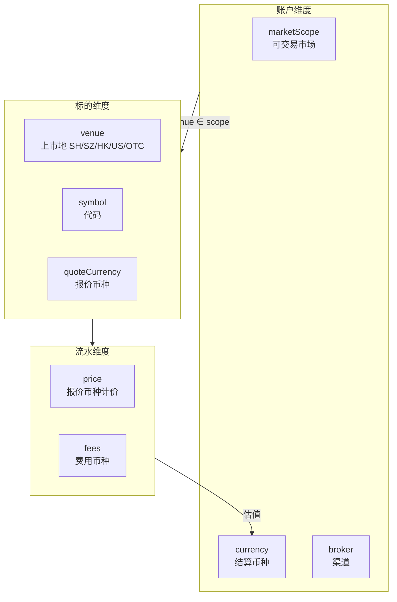

# 多市场扩展计划：港股 / 美股账户

> 版本：v1.0 · 2026-08-30  
> 状态：实施中  
> 目标：在保留 A 股首版体验的前提下，扩展账户、持仓、行情、费率与展示层，支持港股账户、美股账户，以及 **港股账户同时交易港股与美股**。

---

## 1. 背景与目标

### 1.1 现状

- 账户表已有 `currency`（默认 `CNY`）与 `marketScope`（默认 `["CN_A"]`），但 **业务层零引用**。
- 流水 `portfolio_ledger` 仅以 `symbol` 标识标的，无上市地（venue）。
- 行情 100% 东方财富，仅支持沪/深 A 股与场内/场外基金。
- 费率、交易日历、UI 格式化均绑定 A 股 CNY 语义。
- 券商列表含富途、老虎，但无对应港美股能力。

### 1.2 目标

| 能力 | 说明 |
|------|------|
| 港股账户 | 结算币种 HKD，可交易港交所标的 |
| 美股账户 | 结算币种 USD，可交易美股 |
| 港股账户交易美股 | 同一账户 `marketScope: ['HK','US']`，结算 HKD，美股持仓以 USD 报价、HKD 估值 |
| A 股兼容 | 现有数据与交互不退化 |
| 手动记账优先 | 即使暂无实时行情，也应能录入港美股流水并查看持仓 |

### 1.3 非目标（本阶段）

- 自动下单、券商 API 同步成交
- 完整法定假日交易日历（港/美）
- 实时 FX 行情（先用静态/手动汇率）
- 加密资产

---

## 2. 核心概念：三个维度分离

必须区分以下三个维度，避免与现有 `InstrumentInfo.market`（SH/SZ 交易所）混淆：



### 2.1 账户级 `marketScope`（可交易 / 报表范围）

| 值 | 含义 | 允许标的 venue |
|----|------|----------------|
| `CN_A` | 沪深 A 股生态 | `SH`, `SZ`, `OTC` |
| `HK` | 港交所 | `HK` |
| `US` | 美股 | `US` |

**港股账户交易美股**：`marketScope: ['HK', 'US']`，`currency: 'HKD'`。  
账户辖区由 broker（富途/老虎）+ 结算币种表达，**不**用单一 `marketScope` 值代替。

### 2.2 标的级 `venue`（上市地）

| venue | 示例 symbol | 报价币种 |
|-------|-------------|----------|
| `SH` | `600519` | CNY |
| `SZ` | `000001` | CNY |
| `OTC` | 场外基金代码 | CNY |
| `HK` | `00700` | HKD |
| `US` | `AAPL` | USD |

**持仓唯一键**：`venue:symbol`（如 `US:AAPL`、`HK:00700`）。

### 2.3 符号规范

| 输入格式 | 解析结果 |
|----------|----------|
| `600519` / `600519.SH` | `{ venue: SH, symbol: 600519 }` |
| `00700` / `700.HK` / `0700.HK` | `{ venue: HK, symbol: 00700 }` |
| `AAPL` / `AAPL.US` | `{ venue: US, symbol: AAPL }` |
| `BRK.B` / `BRK-B` | `{ venue: US, symbol: BRK.B }` |

---

## 3. 数据模型变更

### 3.1 Migration v19 — `instrument_venue`

新增列 `venue TEXT NOT NULL`，默认值按 symbol 回填：

| 表 | 变更 |
|----|------|
| `portfolio_ledger` | `venue`，索引 `(account_id, venue, symbol)` |
| `portfolio_dividends` | `venue` |
| `executions` | `venue` |
| `trade_episodes` | `venue` |
| `fund_sip_plans` | `venue` |
| `market_daily_bars` | `venue`，PK 改为 `(venue, symbol, trade_date)` |
| `market_bar_sync_meta` | `venue`，PK 改为 `(venue, symbol)` |
| `fund_profiles` | 暂不拆 venue（仍属 CN OTC） |

回填规则（A 股存量）：

```sql
UPDATE portfolio_ledger SET venue = CASE
  WHEN kind = 'otc_fund' THEN 'OTC'
  WHEN symbol GLOB '6*' OR symbol GLOB '5[1568]*' THEN 'SH'
  WHEN symbol GLOB '0*' OR symbol GLOB '3*' OR symbol GLOB '1[56]*' THEN 'SZ'
  ELSE 'SH'
END;
```

### 3.2 类型扩展

```typescript
// src/shared/market/venues.ts
type InstrumentVenue = 'SH' | 'SZ' | 'HK' | 'US' | 'OTC';
type AccountMarketScope = 'CN_A' | 'HK' | 'US';
type QuoteCurrency = 'CNY' | 'HKD' | 'USD';

interface InstrumentRef {
  venue: InstrumentVenue;
  symbol: string;       // 规范化代码
  quoteCurrency: QuoteCurrency;
}

interface PortfolioLedgerEntry {
  venue: InstrumentVenue;
  // ...
}

interface PortfolioPositionView {
  venue: InstrumentVenue;
  quoteCurrency: QuoteCurrency;
  // ...
}
```

### 3.3 汇率（Phase 5）

新表 `fx_rates`（可选 v20）：

```sql
CREATE TABLE fx_rates (
  base_currency TEXT NOT NULL,
  quote_currency TEXT NOT NULL,
  rate REAL NOT NULL,
  updated_at TEXT NOT NULL,
  PRIMARY KEY (base_currency, quote_currency)
);
```

默认内置：`USD/HKD`、`USD/CNY`、`HKD/CNY` 静态值，设置页可覆盖。  
账户汇总：`marketValue_hkd = usd_mv * fx(USD→HKD) + hkd_mv`。

---

## 4. 服务层设计

### 4.1 行情 Provider 抽象

```
src/service/market/
  providers/
    types.ts           # MarketProvider 接口
    registry.ts        # 按 venue 路由
    eastmoney/         # 现有 CN 实现（迁移目录）
    yahoo/             # HK/US 报价（Yahoo Finance）
  market-service.ts    # 门面：resolve/search/quote 按 venue 分发
```

```typescript
interface MarketProvider {
  readonly venues: readonly InstrumentVenue[];
  resolve(query: string): Promise<InstrumentInfo>;
  search(query: string, limit?: number): Promise<MarketSearchHit[]>;
  getQuote(ref: InstrumentRef): Promise<MarketQuote>;
  getQuotes(refs: InstrumentRef[]): Promise<MarketQuote[]>;
}
```

### 4.2 账户服务

| 变更 | 文件 |
|------|------|
| broker 默认 marketScope/currency | `shared/accounts/market-defaults.ts` |
| 创建/更新写入 marketScope | `account-database.ts` |
| 更新允许改 marketScope/currency | `UpdateTradingAccountInput` |
| 流水写入前校验 venue ∈ account.marketScope | `portfolio-database.ts` |

默认映射：

| broker | accountKind | marketScope | currency |
|--------|-------------|-------------|----------|
| futu, tiger | securities | `['HK','US']` | HKD |
| 国内券商 | securities | `['CN_A']` | CNY |
| 基金渠道 | fund | `['CN_A']` | CNY |

### 4.3 持仓聚合

`ledger-service.aggregatePositions`：按 `venue:symbol` 分组，而非仅 `symbol`。

### 4.4 费用系统

扩展 `FeeEstimateInput.market` → `FeeMarket = 'SH' | 'SZ' | 'HK' | 'US' | null`。

| 市场 | 规则（首版简化） |
|------|------------------|
| HK | 佣金（万 X / 最低 HKD）、卖出印花税 0.13% |
| US | 每股佣金 / 最低 USD、卖出 SEC 规费（固定 bps） |
| SH/SZ | 保持现有 |

港美股账户使用独立内置模板：`fee-hk-standard`、`fee-us-standard`。

### 4.5 交易日历

`src/shared/trade-calendar/` 拆为：

```
trade-calendar/
  index.ts           # 门面
  cn.ts              # 现有 A 股（Asia/Shanghai）
  hk.ts              # 周末判定 + Asia/Hong_Kong（假日后续）
  us.ts              # 周末判定 + America/New_York
```

`isTradingDay(date, venue)` 替代全局单一函数。

---

## 5. UI 变更

### 5.1 账户表单 `AccountFormModal`

- 证券账户：多选 **可交易市场**（A 股 / 港股 / 美股）
- **结算币种**下拉：CNY / HKD / USD（随 marketScope 智能默认）
- 富途/老虎选中时默认 `['HK','US']` + HKD
- 费率面板：按 marketScope 展示 A 股 / 港股 / 美股费率区块

### 5.2 流水 / 成交录入

- `SymbolSearchInput`：按账户 marketScope 过滤搜索结果
- 展示 venue 标签（港 / 美 / 沪 / 深）
- 价格/费用使用标的报价币种符号

### 5.3 数值展示

- `ValueDisplay` 增加可选 `currency?: QuoteCurrency`
- `formatDisplayCurrency` 支持 `HK$`、`$`、`¥`
- 账户页 / 持仓页：读取 `account.currency` 格式化汇总

### 5.4 账户列表

- 展示 marketScope  chips（A 股 / 港 / 美）
- 展示结算币种

---

## 6. 校验规则

### 6.1 写入流水

```typescript
function assertVenueAllowed(account: TradingAccount, venue: InstrumentVenue): void {
  const scopes = account.marketScope;
  if (venue === 'SH' || venue === 'SZ' || venue === 'OTC') {
    if (!scopes.includes('CN_A')) throw new Error('该账户不支持 A 股标的');
    return;
  }
  if (venue === 'HK' && !scopes.includes('HK')) throw new Error('该账户不支持港股');
  if (venue === 'US' && !scopes.includes('US')) throw new Error('该账户不支持美股');
}
```

### 6.2 跨账户汇总（ALL）

- 分币种展示小计，或统一换算到用户偏好币种（需 FX）
- 首版：ALL 视图按币种分组，避免错误相加

---

## 7. 分阶段实施

### Phase 1 — 领域基础 ✅ 已完成

- [x] `shared/market/venues.ts` — 枚举与映射
- [x] `shared/market/instrument-id.ts` — 解析 / 格式化 / positionKey
- [x] `shared/accounts/market-defaults.ts` — broker 默认值
- [x] Migration v19
- [x] 单元测试 `instrument-id.test.ts`

### Phase 2 — 账户层 ✅ 已完成

- [x] `UpdateTradingAccountInput` 增加 marketScope / currency
- [x] `account-database` 创建/更新/读取
- [x] `AccountFormModal` UI
- [ ] `AccountsPage` 展示 scope + 币种（待增强）
- [x] 测试通过

### Phase 3 — 流水与持仓 ✅ 已完成

- [x] `PortfolioLedgerEntry.venue`
- [x] `ledger-service` 按 venue:symbol 聚合
- [x] `portfolio-database` CRUD + 校验
- [x] `portfolio-service.listPositions` 多 venue 行情

### Phase 4 — 行情 Provider ✅ 已完成（Yahoo）

- [x] `market-router.ts` 路由 resolve/search/quote
- [x] EastMoney 包装 + venue  enrichment
- [x] Yahoo Finance HK/US Provider
- [x] `SymbolSearchInput` 按 scope 搜索

### Phase 5 — 费率与 FX ⚠️ 部分完成

- [x] `fee-calculator` 扩展 HK/US 简化规则
- [ ] `fx_rates` 表 + 设置页（Phase 5 后续）
- [ ] 账户汇总 FX 换算（Phase 5 后续）
- [ ] `ValueDisplay` 多币种 prop（Phase 5 后续）

### Phase 6 — 导入与日历

- [ ] CSV 导入识别 `.HK` / 美股 ticker
- [ ] 富途/老虎导出模板（文档 + column-guess）
- [ ] 港/美交易日历假日表（JSON 静态）

---

## 8. 测试策略

| 层级 | 用例 |
|------|------|
| instrument-id | 各格式 symbol 解析、冲突、round-trip |
| market-defaults | futu → HKD + [HK,US] |
| venue validation | A 股账户拒 HK、港户允许 US |
| ledger aggregate | 同 symbol 不同 venue 分两仓 |
| fee-calculator | HK 印花税、US SEC |
| migration | v19 回填 venue 正确 |

---

## 9. 风险与决策记录

| 议题 | 决策 |
|------|------|
| 同 symbol 跨市场（如 `700`） | 必须带 venue，禁止裸 symbol 作唯一键 |
| 报价币种 vs 账户币种 | 流水存报价币种；汇总时 FX 换算 |
| 行情源 | CN 继续 EastMoney；HK/US 首版 Yahoo（无 API Key） |
| 假日 | 首版仅周末；假日表 Phase 6 |
| OTC 基金 | venue=`OTC`，scope 映射到 `CN_A` |

---

## 10. 受影响文件清单（全量）

### Shared
- `shared/market/venues.ts`（新）
- `shared/market/instrument-id.ts`（新）
- `shared/market/types.ts`
- `shared/accounts/market-defaults.ts`（新）
- `shared/accounts/types.ts`
- `shared/accounts/account-input.ts`
- `shared/portfolio/types.ts`
- `shared/trade-calendar.ts` → 目录化
- `shared/format/display-presets.ts`
- `shared/schemas/params.ts`

### Service
- `service/database/migrations.ts`
- `service/accounts/account-database.ts`
- `service/accounts/account-service.ts`
- `service/accounts/fee-calculator.ts`
- `service/portfolio/portfolio-database.ts`
- `service/portfolio/ledger-service.ts`
- `service/portfolio/portfolio-service.ts`
- `service/portfolio/reference-unrealized-pnl.ts`
- `service/market/market-service.ts`
- `service/market/providers/*`（新）

### Renderer
- `AccountFormModal.tsx`
- `AccountsPage.tsx`
- `SymbolSearchInput.tsx`
- `PortfolioLedgerModal.tsx`
- `ValueDisplay.tsx`
- `PositionsPage.tsx`

---

## 11. 验收标准

1. 可创建「富途 HKD 账户」，marketScope 含 HK + US。
2. 可在该账户录入 `00700`（HK）与 `AAPL`（US）流水。
3. 持仓列表分两条，币种符号正确。
4. A 股现有账户与数据无回归。
5. 港美股暂无行情时，仍可手动记账；有行情时显示现价。
6. 单元测试与 typecheck 通过。
